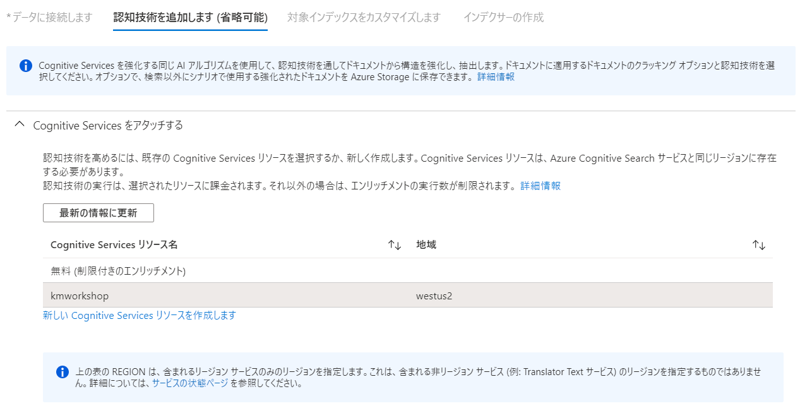
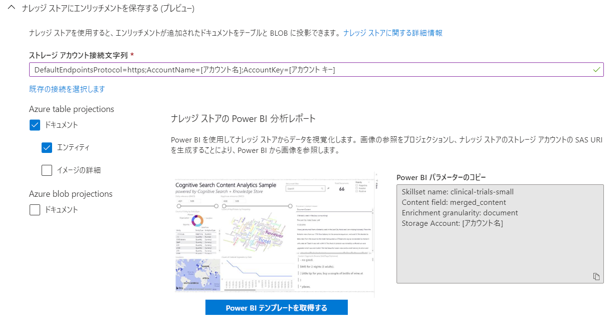
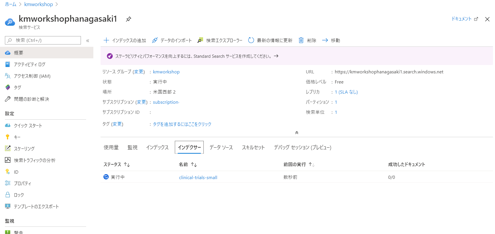
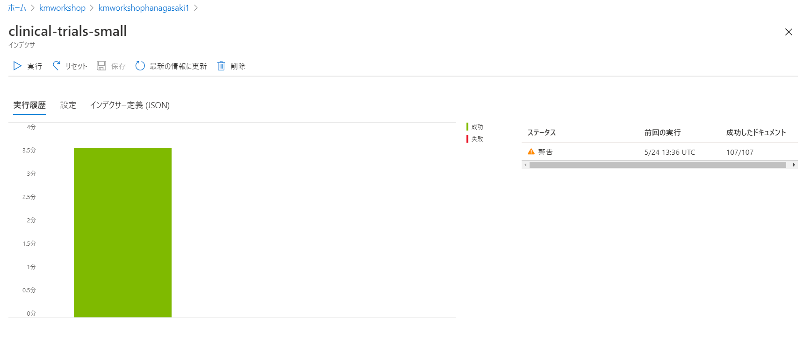
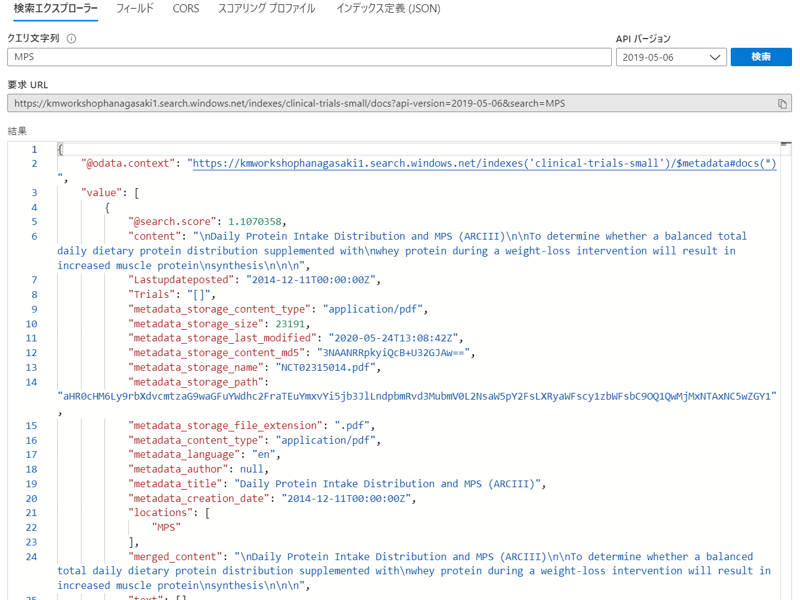

# モジュール1：Azure Portalを使用してインデックスを作成する - コード不要

このモジュールでは、Azure ポータルを使用して、コードを記述せずに最初の Azure Cognitive Search インデックスを作成します。次の手順に従ってください。一連のファイルを取り込みます（臨床試験）。それらのファイルから構造化テキストと非構造化テキストの両方を抽出します。コンテンツのインデックスを作成し、新しいインデックスをクエリする方法を学びます。最後に、Azure ポータルを使用して、豊富なデータをナレッジストア（新しいプレビュー機能）に投影します。これについては、モジュール6で詳しく説明します。

以下の手順では、このラボの [README](./README.md) にある前提条件をすべて完了し、必要なすべてのリソースを Azure サブスクリプションにプロビジョニングしていることを前提としています。これらの手順をまだ完了していない場合は、先に進む前に完了する必要があります。

## ポータルインポートデータフローの使用：


1. 検索サービスに移動し、[**データのインポート**]ボタンをクリックします。これにより、データのインポートウィザードが起動し、データの取り込み、強化、検索インデクサーの作成に必要な手順が示されます。

   
 
1. データインポートウィザードの一部として、[**データに接続します**]タブで、データソースへの接続に必要な情報を入力できます。

+ [**データソース**]のドロップダウンで、[**Azure BLOB ストレージ**]を選択します。

+ データソース名：*clinical-trials-small*

+ 抽出されるデータ：コンテンツとメタデータ

+ 接続文字列： [**既存の接続を選択します**] をクリックし、あなたのストレージアカウントを選択します。*clinical-trials-small* コンテナーを選択します。

    + [**既存の接続を選択します**]を選択しても、使用するストレージアカウントが見つからない場合は、いつでも手動で接続文字列を追加できます。接続文字列を取得するには、Azure ポータルでストレージアカウントを表示し、[**アクセスキー**]を選択して**接続文字列**をコピーします。これを**接続文字列**として貼り付けます。 次に、*clinical-trials-small* になる**コンテナ名**を追加します。
 
   画面は次のようになります。

   

+ [**次へ**]をクリックして、Cognitive スキルをデータに適用します。

## スキルセット

Azure Cognitive Search では、抽出およびエンリッチメントステップを Cognitive スキルと呼び、インデックス付け中に参照されるスキルセットに結合されます。この演習では、Azure ポータルを通じて[組み込みスキル](https://docs.microsoft.com/azure/search/cognitive-search-predefined-skills)を使用する方法を学習します。後のモジュールでは、これらのスキルをプログラムで付加する方法と、独自の[カスタムスキル](https://docs.microsoft.com/azure/search/cognitive-search-custom-skill-interface)を構築する方法を示します。

次の3つのステップでは、表示される3つのドロップダウン矢印を操作します。


### Cognitive Services をアタッチします

これは、初期のラボ設定の一部として以前に作成したリソースであり、事前に作成されたAIモデルを強化するために使用されます。



### エンリッチメントを追加する

スキルセットに名前を付けます: *clinical-trials-small*

+ **merged_content** フィールドを抽出するには、必ず **OCRエンリッチメント** を選択してください。

+ merged_contentフィールドにエンリッチメントを適用して**場所エンティティ**を抽出できます。これを行うには、**場所の名前を抽出** にチェックします。

+ ラボで後で追加のスキルを追加するため、この時点では他のすべてのエンリッチメントボックスを空白のままにします。

   


### ナレッジ ストアにエンリッチメントを保存する (プレビュー)
紹介セッションを思い出してください。ナレッジストアは、5月にパブリックプレビューに導入した新しい機能です。ナレッジストアを使用すると、自然に検索に適さないシナリオでデータを使用できます。データがナレッジストアに読み込まれると、RPA のキックオフ、分析の実行、PowerBI などのツールでの視覚化などを実行できます。

投影は、ナレッジストアでデータを構造化するためのメカニズムです。たとえば、投影を通じて、出力を単一のblobとして保存するか、関連するテーブルのコレクションとして保存するかを選択できます。ナレッジストアのコンテンツを表示する簡単な方法は、Azure ストレージの組み込みのストレージエクスプローラーを使用することです。

ナレッジストアは、次の2種類の投影をサポートしています。

 + テーブル：行と列として最もよく表されるデータの場合、テーブルプロジェクションを使用すると、テーブルストレージでスキーマ化された形状またはプロジェクションを定義できます。

 + オブジェクト：データとエンリッチメントの JSON 表現が必要な場合、オブジェクトプロジェクションは blob として保存されます。

このケースでは、Azure テーブルプロジェクションを使用します。



Azure ポータルでナレッジストアを作成し、後のモジュールで可視化に戻ります。

1. **Azure table projections**で、**ドキュメント**と**エンティティ**が選択されていることを確認します。
2. [既存の接続を選択します]をクリックして、ストレージアカウントを選択します。
3. [**+コンテナー**] をクリックして、*clinical-trials-small-ks* という新しいコンテナを作成します。
4. 上記の手順で作成したコンテナを**選択**します。
2. [**次: 対象インデックスをカスタマイズします**] をクリックします。


## インデックスの定義
このステップでは、Azure Cognitive Search インデックスを設計します。これは、使用するアナライザーのタイプを選択し、どのフィールドとデータが取得可能、フィルター可能、ソート可能、および検索可能かなどの機能を決定するときに、インデックス作成プロセスの重要かつ強力な部分です。

1. インデックスに *clinical-trials-small* のような名前を付けます

2. **Key** をデフォルトオプションのままにします

3. **Suggester 名** に **sg** を追加し、**検索モード** に *analyzingInfixMatching* をセットします。

4.	インデックス定義フィールド：
      + すべてのフィールドが **取得可能** であることを確認してください。
      + locations フィールドが **取得可能/ファセット可能/フィルター可能/検索可能** であることを確認してください。
      + lastUpdatePosted フィールドが**取得可能/フィルター可能/ソート可能**であることを確認してください。
      + コンテンツが日本語であるため、すべての検索可能なフィールドの**アナライザー**として **日本語-Lucene** を設定します。
      + trials, metadata_author, metadata_title、locations の **Suggester** にチェックします。
      + このワークショップでは必要ないため、layoutText を**検索/取得不可**にすることができます。

      

   5. [**次へ：インデクサーの作成**]をクリックします。

##  インデクサーの定義

1. インデクサーに *clinical-trials-small* という名前を付けます。
2. **スケジュール** を**一度**に設定します。
3. [**詳細オプション**]ドロップダウンをクリックし、インデックスキーはデフォルトで Base-64 でエンコードされていることに注意してください。
 
   

4. [**送信**]をクリックします。次に、インデックス作成が行われるまで2〜3分待ってから、ポータルでインデクサーのステータスを確認します。 
 
   


   

## コンテンツの検索
コンテンツのインデックスが作成されたので、ポータルを使用していくつかの検索クエリをテストできます。検索サービスポータルから **検索エクスプローラー** を開き、「MPS」などの検索クエリを入力して、疾患の MPS に関連するすべてのドキュメントを検索し、「検索」を押します。内容を理解するために、さまざまなフレーズや用語でクエリを調整してみてください。
 
 
 
追加のクエリをいくつか試してみましょう。

「ゴーシェ病」(Gaucher's)への参照を検索し、それへの参照があるコンテンツのヒットハイライトを実行します。
```
gaucher&highlight=content
```
結果をスクロールすると、英語-Microsoftアナライザーが「Gaucher」や「Gaucher's」などのこのフレーズのバリエーションを取得でき、デフォルトの `<em> </em>` タグを使用してそれらを強調表示しています。

パラメータ &$count=true を追加して、「ゴーシェ病」に言及する8つのドキュメントがあることを確認します。
```
gaucher&highlight=content&$count=true
```

### Postmanを使用したコンテンツの検索

検索エクスプローラーはこのようなクエリを実行するのに役立ちますが、ほとんどの開発者は外部ツールを使用してサービスに対して作業を開始したいと考えています。そのため、Postman を開いて、以下の残りの検索クエリを実行します。クエリを設定するには、ヘッダーを次のように設定します。
* api-key: [Azure Search ポータルからコピーした管理者キーを入力してください]
* Content-Type: application/json

Azure ポータルで検索サービスを開き、[キー]を選択して、使用可能な管理者キーの1つをコピーすることで、APIキーを取得できます。

コンテンツのインデックス作成を構成するときに、コンテンツから抽出する場所を要求しました。モルキオ病を検索し、結果を metadata_title、locations フィールドのみを返すように制限して、これを見てみましょう。*{name of your service}* を検索サービスの名前で更新することを忘れないでください。
```
GET https://{name of your service}.search.windows.net/indexes/clinical-trials-small/docs?api-version=2019-05-06&search=morquio&$select=metadata_title,locations
```

Postman でのリクエストは次のようになります。

 

**locations** フィールドが、コンテンツから抽出されたすべての場所名を含むコレクション（または文字列の配列）であることに注意してください。

ファセットを使用して、すべての**場所**をグループ化してみましょう。
```
GET https://{name of your service}.search.windows.net/indexes/clinical-trials-small/docs?api-version=2019-05-06&search=morquio&$select=metadata_title,locations&facet=locations
```
検索結果によって上位の場所のリストがどのように追加されたか、およびそれらが Morquio について語っているドキュメントでどのくらいの頻度で見つかったかを確認できます。

次に、Morquio を参照し、場所が「Emory University」であるドキュメントに結果をフィルターしてみましょう。
```
GET https://{name of your service}.search.windows.net/indexes/clinical-trials-small/docs?api-version=2019-05-06&search=morquio&$select=metadata_title,locations&$filter=locations/any(location: location eq 'Emory University')
```

最後のクエリとして、オートコンプリート機能を使用して、ユーザーが入力した内容と一致する用語を提案します。ユーザーが入力を開始する検索ボックスでこれが見られた可能性が高く、システムは一致する可能性のある候補をすばやく提案します。このリクエストが GET ではなく POST であることに注目してください。

```
POST https://{name of your service}.search.windows.net/indexes/clinical-trials-small/docs/autocomplete?api-version=2019-05-06
```
リクエストの Body を "raw" として設定し、次を含めます。
```json
{
   "fuzzy": true,
   "search": "hea", 
   "suggesterName": "sg", 
   "autocompleteMode": "twoTerms"
}
```
このリクエストが「sg」と呼ばれる SuggesterName をどのように使用するかに注意してください。インデックスを構成したときに、これらのオートコンプリートリクエストの強化に使用する列をいくつか選択したことを思い出してください。


### 次：[モジュール2：デモのフロントエンドで結果を視覚化する](Module&#32;2.md)