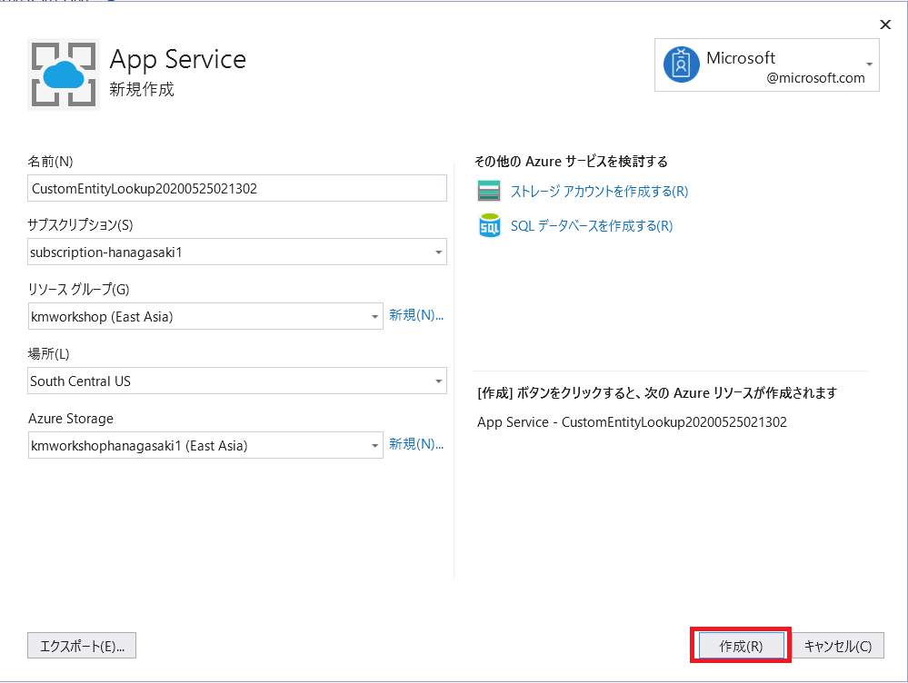
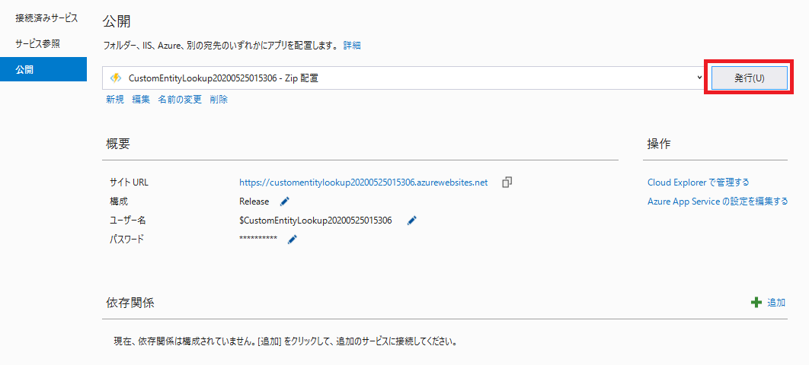

# モジュール3：Azure Functions とカスタムスキルの概要
**目的:** 本モジュールではツールの紹介と、[カスタムスキル](https://docs.microsoft.com/azure/search/cognitive-search-custom-skill-interface)を構築するための重要な概念を提供します。カスタムスキルを構築すると、コンテンツに固有の変換を挿入する方法が得られます。カスタムスキルは独立して実行され、必要なエンリッチメントステップを適用して、非常に強力でドメイン固有のナレッジマイニングソリューションを開発できます。

このモジュールでは、前のモジュールでインデックス付けされたデータを拡張するカスタムスキルを開発します。新しいスキルは、データセットから疾患名を識別して抽出し、ドキュメントに添付された別のフィールドにエンティティとして保存します。これにより、次のような機能を活用できます。

1) [ファセット](https://docs.microsoft.com/azure/search/search-filters-facets)を活用して、検索結果のコーパスで言及されている疾患とその数を表示する
2) 特定の疾患に関するドキュメントを[フィルタリング](https://docs.microsoft.com/azure/search/search-filters)する

これを行うには、Azure Functions を使用して構築された「[カスタムスキル](https://docs.microsoft.com/azure/search/cognitive-search-custom-skill-web-api)」を活用します。基になるドキュメントのテキストを使用して、Azure Cognitive Search によって呼び出されます。Azure Functions はこのテキストを処理し、そのテキストで見つかったエンティティで応答します。これらのエンティティは、別のAzure Cognitive Search Collectionフィールドに格納されます。

また、リリースされた[パワースキル](https://azure.microsoft.com/resources/samples/azure-search-power-skills/)の一部も使用します。 パワースキルは、Azure Cognitive Search のカスタムスキルとして展開される便利な機能集であり、開発を加速するために用意されています。パワースキルセットの新しいアップデートがリリースされるため、このリポジトリを頻繁に確認してください。

## Azure Functions の作成

Azure Functions は、「辞書」ベースの手法を使用して、基礎となるテキストを検索し、辞書に格納されているものと一致する用語またはフレーズで応答します。MLとAIの進歩により、このタイプの「名前付きエンティティ抽出」を実行するためのより高度な方法がありますが、多くの場合、この方法は非常にうまく機能し、実装が非常に簡単です。

開始するには、[Azure Cognitive Search パワースキル](https://github.com/nohanaga/azure-search-power-skills) githubリポジトリのクローンを作成します。
```
  git clone https://github.com/nohanaga/azure-search-power-skills.git
```
このリポジトリをクローンしたら、Visual Studio でソリューションを開きます。

ソリューションエクスプローラーで、**Text** フォルダーの下にあるプロジェクト "CustomEntityLookup" を見つけ、**words.csv** ファイルを開きます。


このファイルに独自の疾患名の辞書を配置します。

ブラウザで [words.csv](./data) を開きます。このプロジェクトの [/data](https://github.com/nohanaga/azure-search-knowledge-mining/tree/master/workshops/data) フォルダーにあります。その csv の内容をコピーします。Visual Studio プロジェクトで **words.csv** を開き、既存のコンテンツを先ほどコピーしたコンテンツで置き換えます。

  **注:** [words.csv](./data) は、完全に吟味されていない小さな辞書ですが、このラボの目的には十分すぎる量です。

## Azure Function コードのウォークスルー

この関数のメインコードは次のファイルにあります。

### CustomEntityLookup.cs

CustomEntityLookup は、前述のパワースキル関数の1つです。エンティティのユーザー定義リストを指定すると、この関数は、一部の入力テキスト内のそのエンティティのすべての出現を検索します。

このファイルにはいくつか興味深い点があるので、コードを少し見てください。


1) 最初に、設定に使用されるグローバル変数のセットに気づくでしょう。これは、関数をデプロイする前に更新でき、words.csv の1つです。
2) 次に、一致の「あいまいさ」、大文字と小文字の区別、デフォルトのアクセントの区別を決定するためのパラメーターを設定できることがわかります。
3) 正規表現ベースのメカニズムを使用して、ユーザーが送信したテキストを反復処理して、辞書のフレーズと一致するフレーズを見つけます。
4) この関数は、見つかったエンティティのセットの両方をエンティティとして含むJSONドキュメントを返します。

## Azure Function をテストする

最初にアプリケーションをローカルでテストします。

1) ソリューションエクスプローラーで CustomEntityLookup を右クリックし、[スタートアップ プロジェクトとして設定]を選択します。
2) F5キーを押します。注：関数の実行を許可する必要がある場合があります。
3) 関数が実行されると、POST 呼び出しに使用する URL が提供されます。このURL をコピーします。


4) Postman を開き、[**+New**]をクリックして新しいリクエスト[Request]を作成します。（これを任意のコレクションに追加できます）
5) コピーした URL を入力し、リクエストタイプを GET から POST に変更します。


5) [**Body**]をクリックし、その下で[**raw**]を選択して、次の JSON に貼り付けます。

```json
  {
    "values": [
        {
            "recordId": "1",
            "data":
            {
                "text":  "This is a 53-year-old man with diabetes, morbid obesity, hepatitis C, and cirrhosis."
            }
        }
    ]
}
```

6) [**Send**]を押すと、次のようなレスポンスが返されます。これは、Azure Search Indexer が受信することを期待しているフォーマットであり、このカスタムスキルのレスポンスのベースとなるものです。


```json
{
    "values": [
        {
            "recordId": "1",
            "data": {
                "entities": [
                    {
                        "name": "cirrhosis",
                        "matches": [
                            {
                                "text": "cirrhosis",
                                "offset": 74,
                                "length": 9,
                                "matchDistance": 0.0
                            }
                        ]
                    },
                    {
                        "name": "diabetes",
                        "matches": [
                            {
                                "text": "diabetes",
                                "offset": 31,
                                "length": 8,
                                "matchDistance": 0.0
                            }
                        ]
                    },
                    {
                        "name": "hepatitis",
                        "matches": [
                            {
                                "text": "hepatitis",
                                "offset": 57,
                                "length": 9,
                                "matchDistance": 0.0
                            }
                        ]
                    },
                    {
                        "name": "obesity",
                        "matches": [
                            {
                                "text": "obesity",
                                "offset": 48,
                                "length": 7,
                                "matchDistance": 0.0
                            }
                        ]
                    }
                ]
            },
            "errors": [],
            "warnings": []
        }
    ]
}
```
7) オプションで、Azure Function アプリにブレークポイントを設定して、それがどのように機能するかについてより良いアイデアを得ることができます。
8) Visual Studio に戻り、実行中のプロジェクトを停止します。

## Azure Functions をデプロイする

Azure Functions が機能するようになったので、それを Azure にデプロイします。

  **注:** 独自のリソース（および結果として発生するコスト）を作成したくない場合は、このセクションをスキップして、次のURLで事前にデプロイされた関数を使用できます 
  
```
https://customentitylookup.azurewebsites.net/api/custom-entity-lookup?code=lJ69aIy1xmIauJgyowP5R8aHbD4GRUGGmVIUZVADk0OlKULHBawrhQ==
```

独自の Azure Functions を作成するには：
1) ソリューションエクスプローラーで、CustomEntityLookupプロジェクトを右クリックし、[**発行**]を選択します。
2) "Azure Functions の従量課金制プラン" を選択します。
3) "新規作成" を選択し、"プロファイルの作成" をクリックします。
4) これにより、サブスクリプションをロードするためのページが起動します（またはサブスクリプションへのログインを要求します）






5) デプロイ後、[Azure ポータル](https://portal.azure.com)を開き、この Azure Functions を見つけます。
6) 「関数の URL の取得」を選択し、URL 全体（コードパラメータを含む）をコピーします。


7) Postman に戻り、以前の localhost リクエストをこの新しい URL に置き換えて、[Send] を押します。上記とまったく同じ結果が得られるはずです。

## Azure Functions - 本番環境 vs 開発環境
上記で使用されている項目のいくつかは、開発目的には役立ちますが、本番用には使用できません。 このいくつかの例は次のとおりです。

* 上記の Azure Functions で「code=」パラメーターを使用することは、本番環境ではベストプラクティスではありませんが、開発には非常に便利です。
* この機能は手動で公開しましたが、運用シナリオでは、継続的インテグレーション方式の展開を活用する方がはるかに現実的です。
* 関数の構成では、コンサンプションプランを選択しました。本番環境では、使用量を詳しく調べて、関数のスケールを調整できるようにする必要があります。これは、より高い可能性が高く、専用またはスケールアウト環境が必要になる可能性があります。

### 次：[モジュール4：オブジェクトモデルを学ぶ](Module&#32;4.md)
